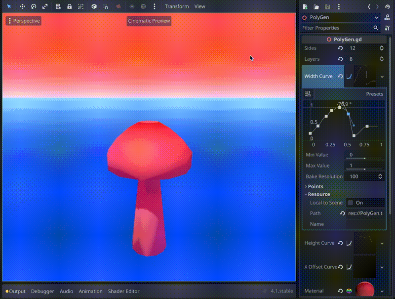
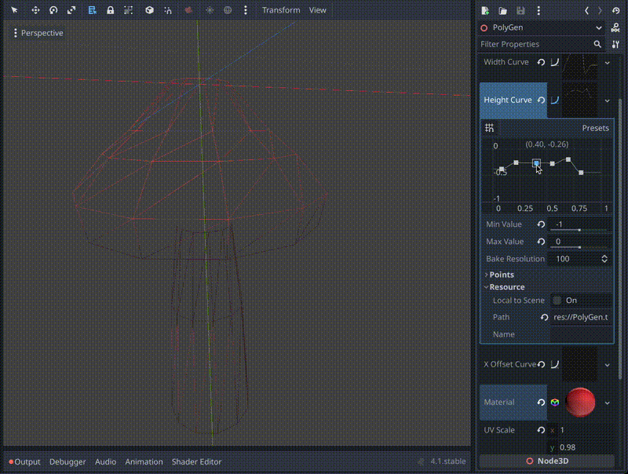

# 🍄 Godot Polygon Generator

A polygon generator tool for Godot to create simple shapes using **S-Curves**.

Once a shape has been created: save the shape as a `.tres` file to use statically in game.

*Floating island example*

*Mushroom example*

*Wireframe example*

